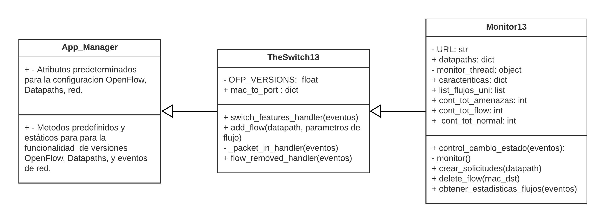
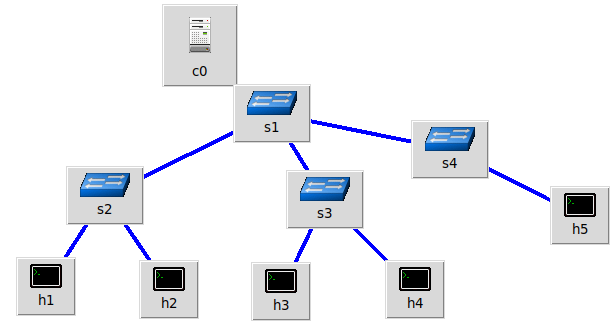
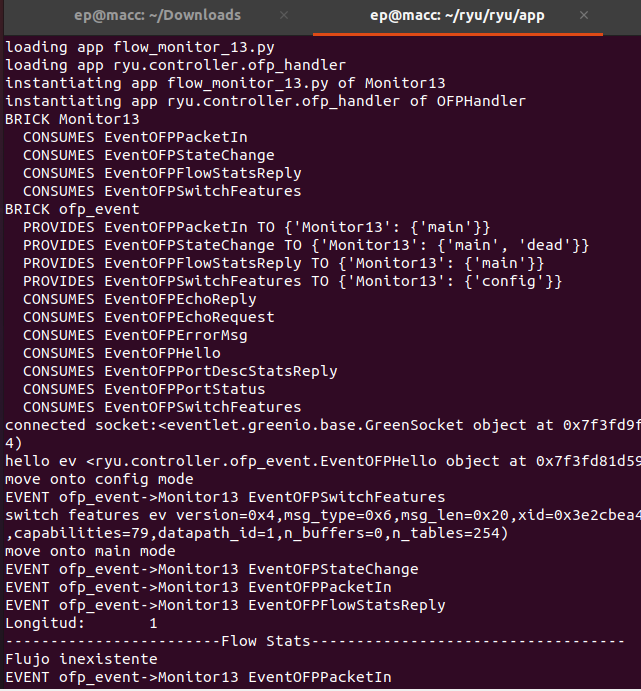
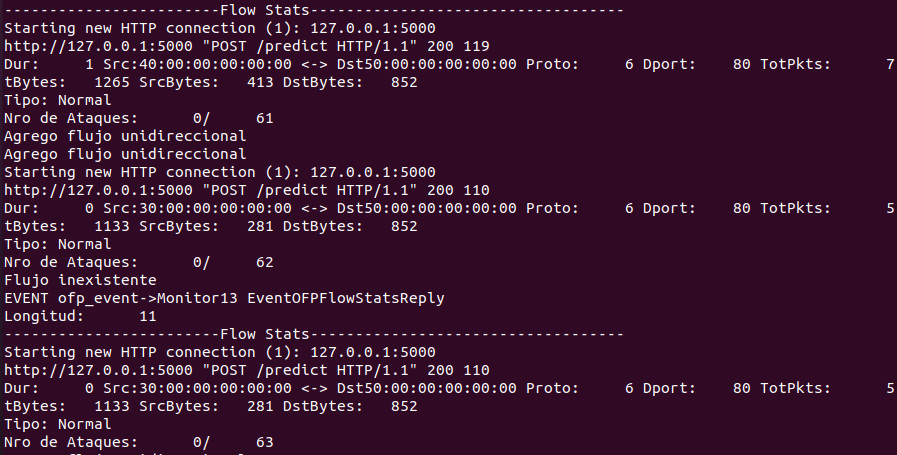
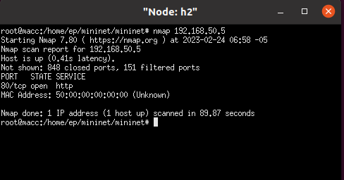
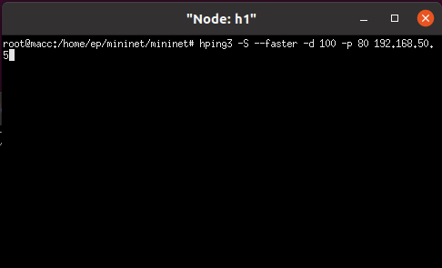
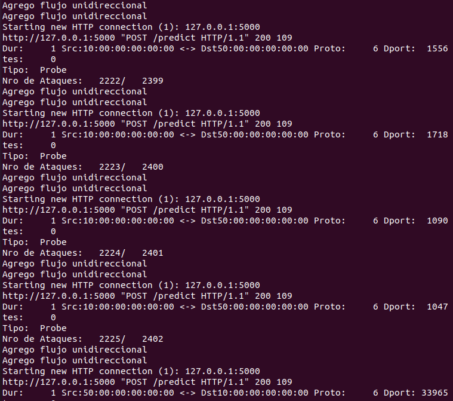
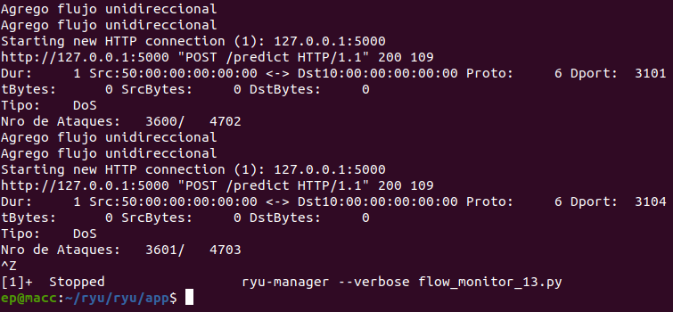

# Introducción
En este repositorio se encuentra los scripts desarrollados de la fase 5 de despliegue de modelos de aprendizaje automático en una Red Definida por Software (SDN).
# Contenido
* **desarrollo_api.py**: contiene los métodos POST para la consulta del flujo de tráfico IP.
* **flow_monitor.py**: aplicación para visualizar flujos de tráfico generados en tiempo real.
* **the_switch_13.py**: aplicación del switch para que permita el intercambio de tráfico bajo el entorno desplegado. Este script soporta la versión 1.3 de OpenFlow para OVSSwitch u otro switch basado en OpenFlow.
* **topologia.py**: script de la topología de red IP.

### Descripción del funcionamiento

En base a la descripción de cada uno de los archivos, la Figura 1 muestra el diagrama de clases de esta quinta fase. La topología en sí, no se relaciona con ninguna de estas clases, si no más bien apunta a la dirección IP del controlador Ryu (servidor), y este es quien se encarga de comunicarse mediante una API (OpenFlow) con los OVSSwitch que apuntan hacia su dirección IP.

***Figura 1***: Diagrama de clases de la fase de implementación y despliegue.

Para crear el entorno SDN se utiliza Mininet (Emulador de entornos SDN), Flask y el controlador RYU. Todo el trabajo de la quinta fase de despliegue se realizó usando Linux. La Figura 2 muestra la topología implementada.

 
***Figura 2***: Topología de prueba.
*Nota*: ejecutar la topología con *sudo python topologia.py*.

Luego, se ejecuta el monitor de flujos y a su vez, se pone en funcionamiento el switch (ya que se utiliza la herencia multinivel). Para hacerlo, se debe utilizar el comando *ryu-manager --verbose the_monitor_13.py*. La Figura 3 muestra el inicio de la ejecución, donde se puede observar el consumo de varias APIs de eventos internos y como aún no se genera tráfico, obtendremos la respuesta "Flujo inexistente".

 
***Figura 3***: Ejecución del monitor de flujos.

Posteriormente, se configura un servidor HTTP de manera local en algunos de los hosts (h5 en este caso) y se genera tráfico normal, es decir, generar solicitudes de un usuario normal. La Figura 4 muestra que cuando el modelo de ML identifica tráfico normal el contador de ataques se mantiene en 0.

 
***Figura 4***: Identificación de tráfico normal.

Ahora, se genera dos tipos de ataques en diferentes hosts. Para el ataque DoS se utiliza la herramienta hping3 y para Probe con Nmap. La Figura 5 muestra los comandos aplicados para estos tipos de ataques dirigidos hacia el servidor Web (h5).

 
***Figura 5***: Creación de ataques Probe y DoS.

La Figura 6 muestra que el modelo ha clasificado el tráfico de tipo Probe, incrementando el contado de ataques. 

 
***Figura 6***: Clasificación de tráfico de tipo Probe.

Por otro lado, la Figura 7 muestra que el modelo de ML ha clasificado el tráfico de tipo DoS. Por lo tanto, va incrementando el contado de ataques.

 
***Figura 7***: Clasificación de tráfico de tipo DoS.
## Librerías utilizadas
* Numpy
* Ryu
* Request
* Flask
* Pickle
* Array
* Mininet
